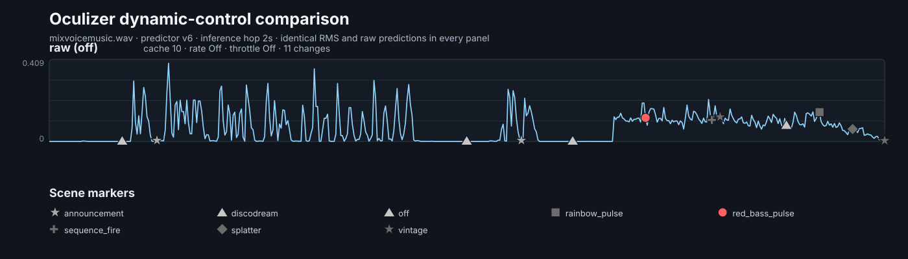
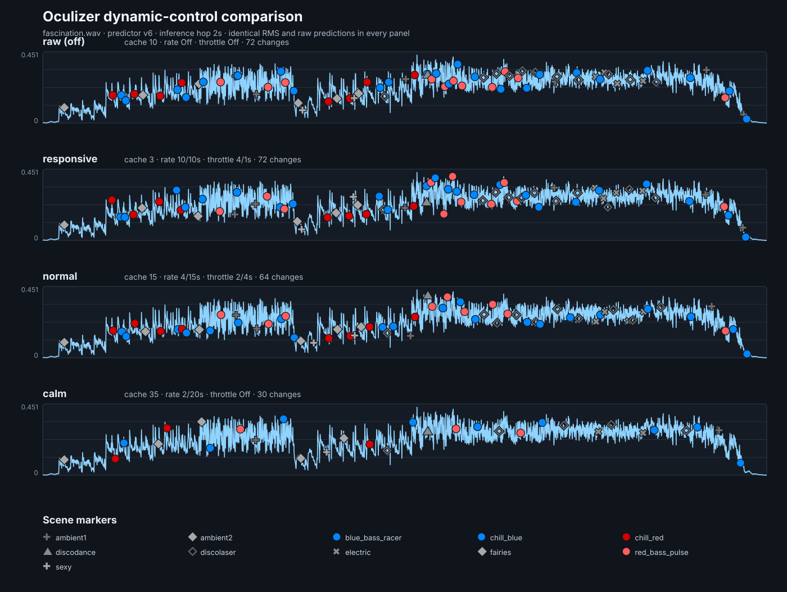

# OculizerQLC

OculizerQLC is a music-reactive lighting controller based on the original Oculizer project available here: https://github.com/LandryBulls/Oculizer. It analyzes audio in real time, automatically selects lighting scenes, and lets an operator take manual control when needed.

This fork enrich and supports two lighting outputs:

- direct DMX through an Enttec/DMXKing-compatible interface;
- QLC+ 5 through OSC, with QLC+ responsible for scenes, chasers, and DMX output.


It can use a live audio device or continuously loop an uncompressed PCM WAV file for simulation and testing before live show. Interactive and headless operation share the same live control commands.

Development architecture, implementation details, decisions, validation history, and the roadmap are maintained in [DEVELOPMENT.md](DEVELOPMENT.md).

## Requirements

- Python 3.11 for the macOS development environment or Python 3.13 for the Debian 13 Raspberry Pi target;
- Git and internet access during installation;
- PortAudio and an audio input for live capture;
- optionally, a virtual audio cable such as BlackHole on macOS;
- an Enttec-compatible interface only for direct-DMX operation;
- QLC+ 5 for the OSC output mode.

A CUDA-capable GPU can accelerate prediction but is not required. Initial model loading can take several seconds on a CPU.

## Installation

```bash
git clone https://github.com/infrafast/OculizerQLC.git
cd OculizerQLC
python -m venv .venv
source .venv/bin/activate
python -m pip install -r requirements.txt
python -m pip install --no-deps \
  "efficientat @ git+https://github.com/LandryBulls/EfficientAT.git@010b68e69d9f75d074eb8720ac06968c38352ac8"
```

On Windows, activate the environment with:

```text
.venv\Scripts\activate
```

Verify the model dependency:

```bash
python -c "import efficientat; print('EfficientAT: OK')"
```

### Raspberry Pi 5 service installation

The Phase 8b installer targets 64-bit Debian 13/Raspberry Pi OS on Raspberry Pi 5. It installs only Oculizer's Python environment, audio system packages, production `oculizerctl` command, and headless systemd service. QLC+, its workspace, and its own service are managed by the separate QLC+ deployment repository and are never installed, configured, started, stopped, or enabled by this repository.

Run the read-only preflight first:

```bash
cd ~/OculizerQLC
chmod +x raspi_service_pack/install.sh
./raspi_service_pack/install.sh --check
```

Install the service pack. Installation neither starts the service nor changes its boot auto-start state:

```bash
sudo ./raspi_service_pack/install.sh
```

Override settings when needed:

```bash
sudo ./raspi_service_pack/install.sh --output qlc-websocket --audio-input default --dynamic-control normal
```

Choose automatic boot operation:

```bash
oculizer-service auto
```

Or leave boot auto-start disabled and operate it manually, including from a QLC+ System Command script:

```bash
oculizer-service start
oculizer-service stop
oculizer-service restart
oculizer-service status
oculizer-service logs
oculizer-service health
oculizer-service last-state
```

Run the same installed configuration in the foreground for diagnostics:

```bash
oculizer-service run-auto
```

Disable future boot auto-start without stopping the currently running process:

```bash
oculizer-service noauto
```

The installer grants the configured service account passwordless permission only for starting, stopping, restarting, enabling, or disabling `oculizer.service`. This allows QLC+ to invoke the absolute commands `/usr/local/bin/oculizer-service start` and `/usr/local/bin/oculizer-service stop` without a terminal or password prompt. It grants no control over QLC+ or any other service.

`oculizer-service auto` controls systemd boot behavior. It is distinct from `oculizerctl auto`, which tells an already running Oculizer process to leave pause/manual-scene mode and resume automatic prediction.

Oculizer passively waits for the separately managed local QLC+ WebSocket endpoint when that transport is selected; it does not own the QLC+ lifecycle. Do not reboot for the first validation: ensure the external QLC+ service is operational, then inspect the Oculizer log first.

## Configuration

The main user configuration files are:

- `config/oculizer.json`: audio input, analysis behavior, dynamic-control profiles, silence, and speech settings;
- `config/qlc_config.json`: QLC+ OSC destination, global controls, and logical-scene mappings;
- `profiles/`: direct-DMX fixture profiles;
- `scenes/`: lighting scenes;
- `profile_fallbacks.json`: profile-specific scene substitutions.

Use another general configuration with `--config PATH`, or another QLC+ configuration with `--qlc-config PATH`.

### Audio input

List the inputs visible to Oculizer:

```bash
python oculize.py --list-devices
```

Select the default device, a recognized alias such as `blackhole` or `scarlett`, a full or partial device name, or a numeric index:

```bash
python oculize.py --input-device blackhole
python oculize.py --input-device "Microphone iMac"
python oculize.py --input-device 0
```

Device names are preferable to indexes because indexes can change after a restart.

### WAV input

On a host without an audio capture device, use an uncompressed PCM WAV file. It is played at real-time speed and loops continuously:

```bash
python oculize.py \
  --audio-file tests/fascination.wav \
  --output qlc-osc \
  --osc-dry-run
```

`--audio-file` cannot be combined with `--prediction-device`. MP3 and online streams are not currently supported.

### Silence and speech scenes

Oculizer can recognize sustained silence and dominant spoken voice independently of the normal music-scene prediction. Each event activates a dedicated logical scene: silence selects `silent`, while speech selects `announcement` so that lighting remains suitable when someone speaks between songs.

Configure the two routes under `audio` in `config/oculizer.json`:

```json
{
  "audio": {
    "silence": {
      "enabled": true,
      "threshold": 0.001,
      "resume_threshold": 0.002,
      "duration_seconds": 2.0,
      "scene": "silent"
    },
    "speech": {
      "enabled": true,
      "threshold": 0.55,
      "music_margin": 0.15,
      "minimum_duration_seconds": 1.0,
      "release_duration_seconds": 0.75,
      "scene": "announcement"
    },
    "fast_detection": {
      "enabled": true,
      "speech": {
        "enabled": true,
        "window_seconds": 2.0,
        "interval_seconds": 1.0
      }
    }
  }
}
```

Change each `scene` value to any logical scene available to the selected output backend. Silence uses the inexpensive RMS thresholds and duration configured under `audio.silence`. Speech routing performs one serialized semantic check per second over the latest two seconds of audio, uses the existing confidence and timing margins, then discards stale scene evidence before returning to music prediction. It shares the existing EfficientAT model and prediction thread: no second model, worker, or event-triggered inference is created. Set the corresponding `enabled` value to `false` to disable a detector.

The following example processes `mixvoicemusic.wav`, which contains silence, spoken voice, and music. The scene markers include `silent` during detected silence and `announcement` when speech becomes dominant, alongside the scenes selected for musical passages. It uses the neutral raw view because silence and speech are priority events rather than ordinary music transitions and do not require a dynamic-control comparison.



This panel example was generated using following command:

```bash
python3 scripts/render_dynamic_control_comparison.py \
  tests/mixvoicemusic.wav \
  --output docs/mixvoicemusic.svg \
  --prediction-hop-seconds 2 \
  --raw-only
```

Please note that since it is a single panel, profiles where first removed from oculizer.json config file (see

## Interactive automatic operation

Example with one live audio stream:

```bash
python oculize.py \
  --profile garage2025 \
  --input-device blackhole \
  --single-stream
```

Example with separate FFT and prediction devices:

```bash
python oculize.py \
  --profile garage2025 \
  --input-device scarlett \
  --prediction-device blackhole
```

Useful options:

| Option | Purpose |
| --- | --- |
| `-p`, `--profile` | Direct-DMX fixture profile |
| `-i`, `--input-device` | Main audio input |
| `--prediction-device` | Separate prediction input |
| `--single-stream` | Use one input for FFT and prediction |
| `--audio-file PATH` | Loop a PCM WAV file instead of capturing audio |
| `--predictor-version VERSION` | Select the prediction model |
| `--scene-cache-size N` | Set prediction smoothing (default: `10`) |
| `--dynamic-control PROFILE` | Apply a configured dynamics profile; see [Dynamic control](#dynamic-control) (default: `off`) |
| `--scene-max-duration SECONDS` | Set the automatic scene-duration base before ±30% per-activation variation (default: `40`) |
| `--output enttec|qlc-osc` | Select the lighting output |
| `--no-graph` | Hide the interactive RMS graph |
| `--list-devices` | List available audio inputs |

System can be used different trained predictors. `v6` is the default predictor and is selected when `--predictor-version` is omitted. Use `--predictor-version v4` or `--predictor-version v5` only for explicit comparison or compatibility tests. `v5` uses the v4 scene mapping as an experimental starting point; because its clusters were trained separately, its scene assignments still require artistic validation. Earlier incomplete predictors have been removed from runtime selection, while their distinct scene mappings remain archived under `oculizer/scene_predictors/legacy_mappings/`.

### Train a concert-specific predictor

You can regenerate `v6` from your own concert recordings. The process first groups acoustically similar four-second excerpts into clusters; it cannot decide what those clusters should look like on stage. You complete that artistic step by listening to representative excerpts and assigning an existing Oculizer scene to every cluster.

Cluster numbers have no permanent meaning: cluster `7` is not intrinsically a calm or energetic cluster, and its meaning can change when the corpus, cluster count, or training options change.

#### 1. Prepare the recording corpus

Place representative MP3, WAV, FLAC, M4A, AAC, or OGG recordings in one directory. Include the different songs, intensities, transitions, and atmospheres expected during a show. Avoid unnecessary duplicates; use `--max-windows-per-track` if a long recording would otherwise dominate the corpus.

The command below intentionally replaces the current v6 model, so back it up first if it must be retained.

#### 2. Extract features and create the clusters

```bash
python3 scripts/train_predictor_v6.py \
  --input /path/to/concert-recordings \
  --clusters 30 \
  --window-seconds 4 \
  --hop-seconds 2 \
  --representatives 8 \
  --force
```

This produces the model files and a review workspace under `oculizer/scene_predictors/v6/review/`. The model deliberately remains unavailable at runtime at this point because its provisional mapping assigns every cluster to `party`.

#### 3. Perform the artistic interpretation

Open `oculizer/scene_predictors/v6/review/cluster_report.md`. For each cluster:

1. Listen to all its files in `review/excerpts/`, not only the first one. The source names and the RMS, speech, singing, and music measurements in the report are useful clues, but they are not artistic decisions.
2. Identify what the excerpts have in common: for example energy, density, rhythm, mood, colour, or the suitability of a strobe effect.
3. Choose the existing scene that should represent that musical character. Use its exact logical name from the scene definitions under `scenes/`.
4. Edit the corresponding value in `oculizer/scene_predictors/v6/scene_mapping.json`.

For example:

```json
{
  "0": "chill_blue",
  "1": "electric",
  "2": "pink_strobe_pulse"
}
```

Every cluster from `0` to `29` must occur exactly once. Several clusters may deliberately use the same scene, but no value may be empty and no cluster may be omitted or added. Speech and silence are detected separately at runtime and use the dedicated `announcement` and `silent` routes; do not try to encode those two events solely through the musical cluster mapping.

This review is normally iterative: when a cluster is ambiguous, replay all its excerpts and choose the scene whose behaviour is safest and most coherent across the whole group, rather than the scene that best matches one isolated excerpt.

#### 4. Approve and finalize the mapping

Rerun the statistical stage from the cached features. Keep the same cluster and window settings used above:

```bash
python3 scripts/train_predictor_v6.py \
  --input /path/to/concert-recordings \
  --clusters 30 \
  --window-seconds 4 \
  --hop-seconds 2 \
  --representatives 8 \
  --reuse-features \
  --mapping oculizer/scene_predictors/v6/scene_mapping.json \
  --force
```

This validates that the mapping is complete, marks the model as reviewed, and enables `--predictor-version v6`. Reusing the feature cache avoids decoding every recording and running feature extraction again.

#### 5. Test the completed predictor

Test it without lighting hardware before using it in a show:

```bash
python3 oculize.py \
  --audio-file tests/fascination.wav \
  --output qlc-osc \
  --osc-dry-run \
  --predictor-version v6 \
  --scene-cache-size 10
```

Check that the selected scenes remain artistically appropriate across several representative tracks. If an assignment is unsatisfactory, edit `scene_mapping.json` and repeat step 4; feature extraction is not required again.

Keep `audio.prediction.window_seconds` equal to the window used for training (`4` in this example). Also ensure every mapped scene exists in the selected output configuration, especially the QLC+ mapping. The feature cache and review excerpts are generated locally and ignored by Git, so retain a backup until the model and artistic mapping are final. Run `python3 scripts/train_predictor_v6.py --help` for less common controls.

Interactive controls:

- `q`: quit;
- `r`: reload scenes;
- `l`: select a dynamic-control profile live;
- `Ctrl+T`: open the scene selector;
- `Ctrl+O`: switch between manual override and automatic prediction from the integrated selector.

The main screen displays a scrolling RMS graph and scene-transition markers. Disable it when a simpler display is preferred:

```bash
python oculize.py --no-graph [other options]
```

Otherwise the main screen looks like:


The milestones correspondent to scenes changes and colors and icons resemble those of the scenes available in the scene control screen (CTRL+T).

Automatic music scene duration uses 40 seconds as its default base. Override the global base at startup with, for example, `--scene-max-duration 20`. On every automatic activation, Oculizer draws one effective duration uniformly within ±30% of the scene-specific or global base and keeps that value stable for the complete activation. A base of 8 seconds therefore produces 5.6–10.4 seconds, while the default base produces 28–52 seconds. When that duration expires, Oculizer prefers a different mapped scene found in recent predictions and otherwise selects `ambient1`. This safety replacement bypasses the active profile's transition admission but is recorded in its internal budgets; the expired prediction holds that one replacement until a genuinely different prediction arrives, and the expired target cannot immediately re-enter. Silence, announcement, and manual overrides are exempt.

A scene can override the global duration by declaring a positive duration in its artistic definition under `scenes/`:

```json
{
  "name": "white_flicker",
  "max_duration_seconds": 8,
  "lights": []
}
```

When `max_duration_seconds` is absent, the global value is used. The example only illustrates the field; retain the scene's real `lights` definition.

The supplied v6 scene set applies an eight-second duration base to every scene with an active strobe declaration. Non-strobing racer/alternating effects and selected high-energy scenes use a 15-second base. Calmer v6 scenes inherit the global 40-second base. The ±30% variation makes these safety-oriented rotations less mechanical; tune the bases in the corresponding `scenes/<name>.json` file.

## QLC+ OSC operation

Start automatic operation with QLC+:

```bash
python oculize.py \
  --output qlc-osc \
  --qlc-config config/qlc_config.json \
  --input-device blackhole
```

Override the OSC destination with `--osc-host HOST` and `--osc-port PORT`.

`config/qlc_config.json` contains every logical scene emitted by predictors v4 and v6 and derives each OSC address as `/oculizer/scenes/<scene-name>`. Transport-specific fields are explicit: `OSCPath` is the OSC address, `OSCaction` defines the OSC gesture, and the optional `caption` overrides the logical name used for WebSocket lookup. WebSocket never interprets `OSCPath` or `OSCaction`. All 30 v6 scenes carry a temporary `"implemented": false` marker so the operator can track QLC+ widget creation. Oculizer deliberately ignores this marker; change it manually as the QLC+ project progresses. Predictor mappings and artistic scene filenames use the same canonical identifiers; historical aliases and misspellings have been normalized.

```json
"silent": {
  "OSCaction": "pushButton",
  "OSCPath": "/oculizer/scenes/silent",
  "caption": "Silent"
}
```

`caption` can be omitted when it is identical to the logical scene name, including differences in case and separators.

### QLC+ 5 WebSocket Virtual Console backend

The optional WebSocket backend targets the verified QLC+ `5.2.2` Web API. It supports scene buttons plus normalized `master`, `bass`, `mid`, and `high` sliders. Start QLC+ with web access enabled; its default endpoint is port `9999`:

```bash
qlcplus -w -wp 9999 /path/to/workspace.qxw
```

Then start Oculizer with:

```bash
python oculize.py --output qlc-websocket --qlc-config config/qlc_config.json --input-device blackhole
```

The backend retrieves `/vc.json` after connecting to `/qlcplusWS`, recursively discovers Virtual Console buttons and sliders, and resolves each requested logical control by a normalized caption. Matching ignores letter case and the common separators space, `_`, and `-`, so `white_fairies`, `WHITE FAIRIES`, and `White-Fairies` are equivalent. No partial or fuzzy match is used. Captions present in QLC+ must remain unique after normalization; ambiguous pairs fail explicitly. Every route uses its logical name as the default caption, or can declare `"caption": "Exact QLC+ label"`. For every requested button—including `silent`—the backend reads the actual QLC+ `actionType` and sends the matching gesture: state-aware activation for Toggle and Blackout, press/release for Flash, and one momentary press for Stop All. The type or function assigned in QLC+ is therefore not duplicated in Oculizer configuration. Missing controls, unsupported widget/action types, and malformed states fail explicitly. Put mutually exclusive scene buttons in a QLC+ Solo Frame; Oculizer activates the requested button and does not toggle the previous one off.

The `silent` entry is an ordinary scene route. Its explicit `OSCaction: "pushButton"` sends a press (`1.0`) followed by a release (`0.0`) to `/oculizer/scenes/silent`. WebSocket ignores the OSC fields, resolves the `silent` caption, and adapts to the discovered QLC+ button type. Silence does not imply blackout: the QLC+ function assigned to the `Silent` widget owns the desired lighting state. `announcement`, fallback resolution, and ordinary scenes follow the same transport separation.

Dry-run validates configuration and logs intended captions without opening a network connection:

```bash
python oculize.py --output qlc-websocket --qlc-config config/qlc_config.json --qlc-dry-run --input-device blackhole
```

Continuous values are mapped from Oculizer's normalized `0..1` range to each discovered slider's QLC+ range. Connection or protocol failure is reported explicitly, and automatic reconnect plus authenticated (`-wa`) web access are not yet implemented. QLC+ web access is disabled by default, uses `ws://` rather than encrypted `wss://`, and should remain bound to the local host or a trusted network. See the official [QLC+ Web Interface](https://docs.qlcplus.org/v5/advanced/web-interface) and [Web API](https://docs.qlcplus.org/v5/advanced/web-interface/web-api) documentation.

### Real-time audio controls

In addition to selecting scenes, Oculizer can continuously send four normalized values from `0` to `1` for use inside QLC+:

| Default OSC path / WebSocket caption | Signal | Typical QLC+ use |
| --- | --- | --- |
| `/oculizer/master` | Overall audio RMS/level | Grand master, scene brightness, or a dimmer group |
| `/oculizer/bass` | Low-frequency energy | Bass pulses, fixture intensity, or effect speed |
| `/oculizer/mid` | Mid-frequency energy | Color, movement, or secondary intensity |
| `/oculizer/high` | High-frequency energy | Sparkle, strobe depth, or fast effects |

Enable or disable the overall level under `audio.master_modulation`, and the frequency controls under `audio.frequency_modulation` in `config/oculizer.json`:

```json
"master_modulation": {
  "enabled": true
},
"frequency_modulation": {
  "enabled": true,
  "bands": {
    "bass": { "enabled": true },
    "mid":  { "enabled": false },
    "high": { "enabled": false }
  }
}
```

Set `frequency_modulation.enabled` to `false` to disable all three bands, or change one band's `enabled` value independently. The supplied configuration enables `master` and `bass` but leaves `mid` and `high` disabled. Keep the other tuning fields already present in the configuration when editing these abbreviated examples.

For OSC, enable a QLC+ OSC input listening on the configured port (`7700` by default), create a Virtual Console slider for each signal, and assign its external input with QLC+'s input auto-detection. For WebSocket, create sliders captioned `master`, `bass`, `mid`, and `high`; captions can be overridden under `controls` in `config/qlc_config.json`. Each control object contains its transport-specific `OSCPath` and its WebSocket `caption`. The current reference workspace contains `master` and `bass`; add `mid` and `high` before enabling those bands. Direct Enttec output does not consume these controls.

Test without sending UDP packets:

```bash
python oculize.py \
  --audio-file tests/fascination.wav \
  --output qlc-osc \
  --osc-dry-run
```

Hide selected paths from dry-run logs by repeating `--filter-osc`:

```bash
python oculize.py \
  --audio-file tests/fascination.wav \
  --output qlc-osc \
  --osc-dry-run \
  --filter-osc /oculizer/bass \
  --filter-osc /oculizer/mid \
  --filter-osc /oculizer/high
```

The reference QLC+ workspace is `qlc/qlc.qxw`, and its input profile is `qlc/Oculizer-OSC.qxi`. On macOS, install the profile in `~/Library/Application Support/QLC+/InputProfiles/` before opening the workspace.

## Direct-DMX dry run

Exercise the Enttec rendering path without a connected DMX interface:

```bash
python oculize.py \
  --profile garage2025 \
  --audio-file tests/fascination.wav \
  --output enttec \
  --dmx-dry-run
```

The dry run prints a maximum of three changed-channel summaries per second. Hide all DMX frame summaries with `--filter-dmx`:

```bash
python oculize.py \
  --profile garage2025 \
  --audio-file tests/fascination.wav \
  --output enttec \
  --dmx-dry-run \
  --filter-dmx
```

## Manual scene selection

Run the standalone direct-DMX selector:

```bash
python toggle.py --profile garage2025 --input blackhole
```

Run the standalone QLC+ selector:

```bash
python toggle.py --output qlc-osc --qlc-config config/qlc_config.json
```

Selector controls:

- arrow keys: move through the scene grid;
- Enter: activate a scene;
- type letters: search by prefix;
- Escape: clear the search;
- `Ctrl+R`: reload scenes and QLC+ mappings;
- `Ctrl+T`: return to the automatic screen when using the integrated selector;
- `Ctrl+Q`: quit.


## Headless operation

Run automatic prediction and QLC+ routing without curses:

```bash
python oculizer_service.py \
  --output qlc-osc \
  --input-device blackhole \
  --qlc-config config/qlc_config.json
```

The process handles `SIGINT` and `SIGTERM` cleanly. Raspberry Pi and systemd installation are covered by the next development phase and are not yet documented as production-ready.

## Live runtime control

Interactive and headless operation expose the same local control socket. From another terminal:

```bash
python3 oculizerctl.py status
python3 oculizerctl.py auto
python3 oculizerctl.py pause
python3 oculizerctl.py scene wave
python3 oculizerctl.py dynamic-controls
python3 oculizerctl.py dynamic-control responsive
python3 oculizerctl.py dynamic-control normal
python3 oculizerctl.py dynamic-control calm
python3 oculizerctl.py dynamic-control off
```

The default socket is `/tmp/oculizer-<uid>.sock`. Start the application with `--control-socket PATH` to use another path, then place `--socket PATH` before the `oculizerctl.py` subcommand. Use `--no-control-socket` to disable external control.

`pause` only suspends prediction and automatic routing/modulation updates; it deliberately leaves the current QLC+ scene, blackout state, master, and frequency controls untouched. `auto` clears pause or manual override and resumes automatic operation from fresh prediction input. `scene NAME` forces a configured logical scene. Live changes last until the application restarts and do not rewrite configuration files.

## Dynamic control
The engine responsivity can be controlled using a dynamic parameter. This is used when you want to calm down the scene or unleash a very color full show. 
Use `--dynamic-control PROFILE` at startup, press `l` in the interactive interface, or run `oculizerctl dynamic-control PROFILE` from another terminal. The active profile is shown in the status area and changes received through the control socket appear there automatically.

Named profiles can be added, adjusted, or removed under `control.dynamic_controls` in `config/oculizer.json`. An empty object is valid and leaves `off` as the only available profile. Selecting a named profile applies its complete tuple, including its cache value, so it takes precedence over `--scene-cache-size` while active. Starting without `--dynamic-control` selects the reserved `off` state: it restores the startup cache value and disables transition filtering.

Fast silence, resume, energy-edge, and speech detection is configured independently under `audio.fast_detection`. Dynamic-control profiles only govern ordinary music-scene admission: they do not alter fast detector windows, thresholds, or polling intervals. The v6 artistic classifier continues to use its four-second training-compatible window, while one shared EfficientAT instance performs serialized two-second semantic checks for priority speech routing.

The following values are recommended starting points when those named profiles are configured:

| Profile | Cache | Throttle | Rate limit | Behavior |
| --- | ---: | ---: | ---: | --- |
| `responsive` | `3` | `4/1` | `10/10` | Fast response, close to unrestricted behavior |
| `normal` | `15` | `2/4` | `3/15` | Stable general-purpose behavior with clearly restrained transitions |
| `calm` | `5` | `1/6` | `2/20` | Immediate candidate detection with deliberately infrequent activation |
| `off` | startup value | `Off` | `Off` | Restore startup smoothing and leave predictions unrestricted |

`off` is the least restricted profile, but it is not always the fastest. It keeps the normal startup cache (`10` by default), whereas `responsive` uses a shorter cache (`3`) and can therefore react sooner. In exchange, `responsive` retains generous safeguards against unusually rapid or sustained changes. If the predictions are already stable enough to remain below those safeguards, `off` and `responsive` can select the same scenes and produce the same number of changes.

The comparison below demonstrates the intended progression on the current reference WAV: `off` and `responsive` each produce 80 changes, `normal` produces 55, and `calm` produces 34. Raw predictions are sampled every two seconds. Responsive therefore remains close to unrestricted behavior, while normal and calm provide increasingly deliberate scene retention.

The reference file begins with silence and spoken voice before the music. Every profile follows the same priority timeline: `silent` from `2.0s` to `18.0s`, `announcement` from `18.0s` to `19.3s`, then `silent` until `24.0s`. A second silence routes to `silent` from `47.0s` to `56.0s`. These identical intervals demonstrate that silence and speech routing are independent from ordinary dynamic-control limits; only subsequent artistic scene changes differ between profiles.

### Visual comparison

The following image replays the same RMS curve and raw v6 predictions through the neutral `off` state and every dynamic-control profile currently declared in `config/oculizer.json`. A colored dot or gray symbol marks the active scene at startup and each subsequent transition. The comparison is illustrative rather than a live-performance benchmark: model inference is sampled every two seconds for practical documentation generation, while routing, cache smoothing, silence, speech, scene-duration, rate, and throttle behavior are simulated every 0.1 seconds.



Regenerate the image after changing a predictor, scene rules, or dynamic-control profiles:

```bash
python3 scripts/render_dynamic_control_comparison.py \
  tests/fascination.wav \
  --output docs/dynamic_control_comparison.svg \
  --prediction-hop-seconds 2
```

The script accepts any PCM WAV and automatically creates one panel for `off` plus one panel for every configured profile. Use `--config`, `--predictor-version`, `--prediction-hop-seconds`, `--simulation-step-seconds`, `--off-cache-size`, `--seed`, or `--width` when a different comparison is required. Smaller prediction hops are closer to the intended live inference cadence but take proportionally longer to compute.

### QLC+ buttons

QLC+ 5 Virtual Console buttons can call the installed client through script functions such as:

```javascript
Engine.systemCommand("/usr/local/bin/oculizerctl dynamic-control responsive");
Engine.systemCommand("/usr/local/bin/oculizerctl dynamic-control normal");
Engine.systemCommand("/usr/local/bin/oculizerctl dynamic-control calm");
Engine.systemCommand("/usr/local/bin/oculizerctl dynamic-control off");
```

The `/usr/local/bin/oculizerctl` installation path will be provided by the Raspberry Pi deployment phase. During development, use the absolute paths to Python and `oculizerctl.py`.

## Test mode

Run prediction without FFT or DMX output:

```bash
python oculize.py --test --profile mobile
```

## Troubleshooting

- No audio input: run `python oculize.py --list-devices`, or use `--audio-file` on an audio-less host.
- `PortAudio library not found`: install the system PortAudio library before using live capture; WAV mode does not require a capture device.
- No DMX interface: use `--output enttec --dmx-dry-run` for a hardware-free test.
- Slow or apparently blank startup: model loading can take several seconds on a CPU.
- Excessive OSC or DMX dry-run logs: use repeatable `--filter-osc PATH` or `--filter-dmx`.
- Dark or substituted scene: check the active profile, `profile_fallbacks.json`, and QLC+ mappings.
- Runtime details and errors: inspect `oculizer.log`.
- Installation cannot find EfficientAT on PyPI: run the separate EfficientAT installation command shown above.

Display all supported command-line options with:

```bash
python oculize.py --help
```

## License and credits

The project is distributed under the MIT License. Audio prediction relies on EfficientAT, librosa, PyTorch, and scikit-learn.
