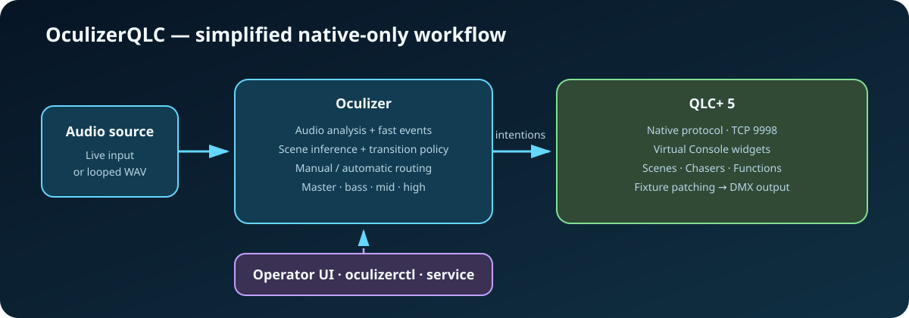

# OculizerQLC

OculizerQLC analyzes live or recorded audio, predicts an artistic lighting
scene, and controls a local or remote QLC+ 5 project through the QLC+ Native
Server. QLC+ owns the Virtual Console, Functions, fixtures, universes, and DMX
output. Oculizer owns audio analysis, inference, transition policy, priority
silence/speech detection, and normalized `master`, `bass`, `mid`, and `high`
modulations.



Development decisions, implementation history, rollback information, and the
active roadmap are maintained in [DEVELOPMENT.md](DEVELOPMENT.md).

## Requirements

- Python 3.11 on the macOS development system or Python 3.13 on the Debian 13
  Raspberry Pi 5 production target;
- QLC+ 5 with its Native Server enabled (TCP port `9998` by default);
- PortAudio and an audio input for live operation;
- optionally, a virtual audio device such as BlackHole on macOS;
- Git and internet access during installation.

No Enttec interface, Oculizer fixture profile, OSC input, or QLC+ WebSocket
connection is used.

## Installation

```bash
git clone https://github.com/infrafast/OculizerQLC.git
cd OculizerQLC
./install.sh
```

The installer creates or updates `.venv` and installs the Python dependencies.
Run it again after updating the repository. To select a particular interpreter:

```bash
./install.sh --python python3
```

## Interactive operation

Start with the OS-default input:

```bash
./.venv/bin/python oculize.py
```

Select BlackHole on macOS:

```bash
./.venv/bin/python oculize.py --input-device blackhole
```

List available audio devices:

```bash
./.venv/bin/python oculize.py --list-devices
```

Use an uncompressed PCM WAV file instead of a live input:

```bash
./.venv/bin/python oculize.py --audio-file tests/fascination.wav
```

Validate configuration and logical intentions without opening a QLC+ network
connection:

```bash
./.venv/bin/python oculize.py --dry-run --audio-file tests/mixvoicemusic.wav
```

Dry-run verifies logical captions but cannot prove that corresponding widgets
exist in the QLC+ project currently loaded.

Interactive controls:

- `Ctrl+T`: open the integrated scene selector;
- `Enter`: activate the selected manual scene;
- `Esc`: leave manual override and resume automatic routing;
- `l`: select a configured dynamic-control policy;
- `r`: reload the application scene metadata and QLC+ routing/inventory;
- `q` or `Ctrl+C`: stop cleanly.

A direct click in the QLC+ GUI does not put Oculizer into manual override.
Use the integrated selector or `oculizerctl scene NAME`; alternatively pause
Oculizer before manipulating QLC+ directly.

## Headless operation

Run the non-interactive process directly:

```bash
./.venv/bin/python oculizer_service.py --input-device default --dynamic-control normal
```

The headless and interactive applications use the same inference, routing,
native connection, configuration, and runtime-control implementation.

## QLC+ Native setup

1. Enable the QLC+ Native Server, normally on TCP port `9998`.
2. Start Oculizer.
3. Authorize the `OculizerQLC` client in the QLC+ GUI when requested.
4. Create one Virtual Console button for each logical scene you want to use.
5. Give each button the logical scene caption, matching without case or common
   separators. Use `lighting.routing.caption_overrides` only for exceptions.
6. Create sliders captioned `master`, `bass`, `mid`, and `high` for every
   modulation enabled in the configuration.

Button type, action, function association, Frame/Solo Frame ownership, slider
range, and widget IDs are discovered from the active QLC+ project. Widget IDs
are never stored by Oculizer. Toggle, Blackout, Stop All, Flash, and future
button actions therefore retain their QLC+ semantics.

The native client connects asynchronously. Audio and inference do not block if
QLC+ starts late, is restarted, or is awaiting authorization. After reconnect,
Oculizer downloads a fresh project inventory before resuming output.

Connection overrides are available when needed:

```bash
./.venv/bin/python oculize.py --qlc-host 127.0.0.1 --qlc-port 9998
```

An empty `lighting.native.encryption_key` uses QLC+'s built-in key. A custom key
can be stored in the configuration or supplied with `--qlc-encryptionkey KEY`.

## Configuration

`config/oculizer.json` is the only application configuration. Select another
complete configuration with:

```bash
./.venv/bin/python oculize.py --config /absolute/path/oculizer.json
```

Its main sections are:

- `control.dynamic_controls`: named transition-policy presets;
- `audio.input_device`: default live input selector;
- `audio.prediction`: artistic prediction window and interval;
- `audio.fast_detection`: low-cost priority speech evaluation;
- `audio.silence` and `audio.speech`: priority routing thresholds and scenes;
- `audio.master_modulation` and `audio.frequency_modulation`: normalized QLC+
  slider signals;
- `lighting.native`: native host, port, authorization, reconnect, and dry-run;
- `lighting.controls`: logical modulation name to QLC+ slider caption;
- `lighting.routing`: button pulse, fallback scene, and caption exceptions;
- `lighting.scene_metadata`: logical scene descriptions, design guidance, and
  optional maximum durations.

Every logical scene carries one advisory `design_behavior`:

- `static`: deliberately fixed look;
- `normal`: autonomous or time-driven animation/movement;
- `responsive`: intended to react materially to audio modulation.

This metadata helps design the corresponding QLC+ Function. It never changes
inference, routing, transition policy, or slider processing. If a scene omits
`max_duration_seconds`, automatic routing uses `--scene-max-duration`, whose
default is 40 seconds, with the existing bounded random variation and
anti-ping-pong policy.

The prediction window should match model training. The supplied v6 model uses
four seconds and is the runtime default:

```bash
./.venv/bin/python oculize.py --predictor-version v6
```

## Runtime control

While either runtime is active:

```bash
./oculizerctl.py status
./oculizerctl.py scene ambient1
./oculizerctl.py pause
./oculizerctl.py auto
./oculizerctl.py preset calm
./oculizerctl.py master 0.5
./oculizerctl.py bass 0.8
```

The installed `oculizerctl` wrapper automatically discovers one active Unix
socket. If several runtimes are active, select one explicitly with
`--socket PATH`. Pause only suspends inference; it does not alter QLC+ buttons
or sliders.

## Raspberry Pi 5 service

QLC+, its workspace, and its service are maintained independently. This
repository installs only Oculizer and never starts, stops, configures, or
installs QLC+.

After every native-only deployment-schema update, reinstall the service pack:

```bash
cd ~/OculizerQLC
chmod +x raspi_service_pack/install.sh
./raspi_service_pack/install.sh --check
sudo ./raspi_service_pack/install.sh --audio-input default --dynamic-control normal --service-user pi
```

Installation preserves whether the service is running and whether boot
auto-start is enabled. Restart explicitly to adopt new code/configuration:

```bash
oculizer-service restart
```

Lifecycle commands remain compatible with raspiLightGUI:

```text
oculizer-service start
oculizer-service stop
oculizer-service restart
oculizer-service status
oculizer-service logs
oculizer-service run-auto
oculizer-service auto
oculizer-service noauto
oculizer-service last-state
oculizer-service health
```

`oculizer-service auto` controls systemd boot startup. `oculizerctl auto`
changes an already-running process back to automatic prediction.

The installer regenerates `/etc/oculizer/deployment.json` and retains the
previous file as `deployment.json.previous`. The deployment file contains only
machine-specific service values; application and lighting configuration remain
in the repository's `config/oculizer.json`. See
[raspi_service_pack/README.md](raspi_service_pack/README.md) for details.

## Troubleshooting

- `waiting-for-qlc-authorization`: authorize `OculizerQLC` in the QLC+ GUI.
- Missing scene button: verify its caption or add a `caption_overrides` entry.
- Slider does not move: verify the slider exists and its band is enabled under
  `audio.frequency_modulation.bands`.
- No live audio: run `--list-devices`, then select `default`, an alias, a
  partial device name, or an index.
- Slow or queued predictions: keep the four-second v6 window and one-second
  interval; inspect queue depth and CPU before tightening them on Raspberry Pi.
- Control client cannot connect: run `oculizerctl status`; its error lists all
  socket paths tested and explains how to select one explicitly.

Oculizer reuses the existing audio and EfficientAT inference pipeline for fast
speech decisions. It does not create another model, FFT pass, unbounded queue,
or polling worker, keeping Raspberry Pi CPU and memory use bounded.
